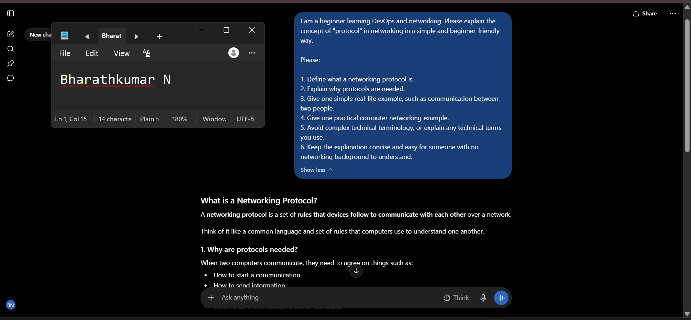
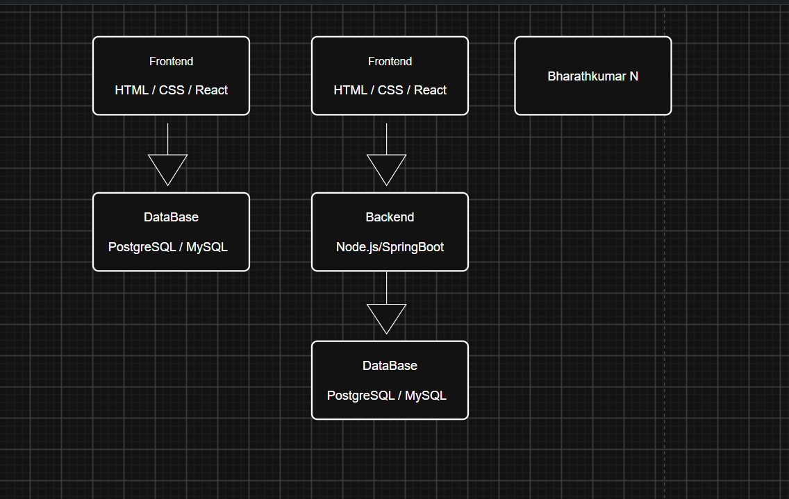
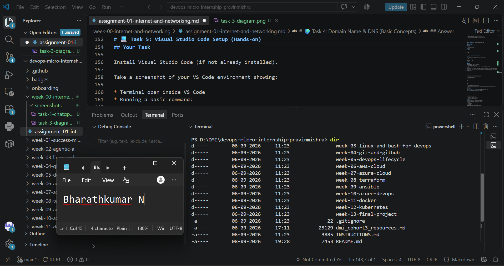

# Week 00 - Internet and Networking

Part of the DevOps Micro Internship (DMI) Cohort 3 with Agentic AI

---

# 🧑‍💻 Task 1: Using ChatGPT as Your Learning Assistant

## Scenario

You're new to DevOps and will frequently encounter technical questions. ChatGPT can be your learning companion.

## Your Task

Write a clear ChatGPT prompt to help you understand:

> "What is a protocol in networking? Explain with a simple real-life example."

Take a screenshot of your interaction showing:

* Your detailed prompt (with clear expectations)
* ChatGPT's simplified response with an example

## Screenshot

Save your screenshot in the `screenshots` folder and update the file name below.




Replace `task-1-chatgpt.png` with your actual screenshot file name.

---

## What I Learned (2–3 lines)

I learned that a networking protocol is a set of rules that devices follow to communicate with each other. I also understood that protocols make communication predictable and organized, similar to how people follow common rules when communicating.

---

# 🌐 Task 2: Internet and Networking

## Scenario

Your friend is launching an online bookstore named **EpicReads**.

He asked you to explain how users globally can access his website hosted in Finland.

## Your Task

Write a short explanation (**100–150 words**) that includes:

* Packet Switching
* IP Address
* TCP/IP
* HTTP/HTTPS

💡 **Tip:** You may use ChatGPT (as demonstrated in Task 1) to refine your explanation.

## Answer

When a user anywhere in the world visits EpicReads, their request travels through the Internet to the web server hosted in Finland. The data is divided into small units called packets, and packet switching allows these packets to travel through different network paths before reaching the destination. The server is identified using an IP address, which acts like a numerical address for the computer. TCP/IP provides the basic communication rules that allow the user's device and the EpicReads server to exchange data reliably across networks. When the user accesses the website, the browser communicates with the server using HTTP or, more securely, HTTPS. The server then sends the requested webpage back to the user's device through the Internet.


---

# 🏗️ Task 3: Application Architecture & Stack

## Scenario

EpicReads bookstore has two application versions:

### Two-Tier Application

* Frontend
* Database

### Three-Tier Application

* Frontend
* Backend
* Database

## Your Task

* Draw simple diagrams (hand-drawn or tool-based such as draw.io)
* Label each layer clearly
* List at least two common technologies or tools used for each layer
* Submit a screenshot or photo clearly showing your own drawing

## Diagram Screenshot / Photo

Save your diagram image in the `screenshots` folder and update the file name below.




Replace `task-3-diagram.png` with your actual diagram file name.

---

## Technologies Used

### Frontend

* React.js
* HTML, CSS and JavaScript

### Backend

* Node.js
* SpringBoot

### Database

* PostgreSQL
* MySQL


---

# 🌍 Task 4: Domain Name & DNS (Basic Concepts)

## Scenario

Your friend's bookstore **EpicReads** is currently accessible through:

```text
52.172.142.222:3000
```

He purchased the domain:

```text
epicreads.com
```

## Your Task

In **50–100 words**, explain in your own words:

1. What is DNS (Domain Name System)?
2. Which DNS record type should be used to connect the domain to the given IP, and why?

## Answer

DNS (Domain Name System) translates human-readable domain names into IP addresses so users do not have to remember numerical addresses. For EpicReads, an A record should be used because it maps the domain name epicreads.com to the IPv4 address 52.172.142.222. When a user enters epicreads.com, DNS can resolve the domain to that IP address, allowing the browser to contact the server. The :3000 part represents the application port and is separate from the DNS A record.


---

# 💻 Task 5: Visual Studio Code Setup (Hands-on)

## Your Task

Install Visual Studio Code (if not already installed).

Take a screenshot of your VS Code environment showing:

* Terminal open inside VS Code
* Running a basic command:

### Windows

```powershell
dir
```

### Linux / macOS

```bash
pwd
ls
```

* Your selected VS Code theme clearly visible

⚠️ **Important:** The screenshot must show your username or another identifiable detail to confirm it is your environment.

## Screenshot

Save your screenshot in the `screenshots` folder and update the file name below.




Replace `task-5-vscode.png` with your actual screenshot file name.

---

# 🔗 Task 6: Publish Your Assignment as a LinkedIn Post

## Objective

Publishing on LinkedIn helps you:

* Build your professional online presence
* Reinforce your learning
* Document your DevOps journey publicly

## Your Task

Summarize your answers from Tasks 1–5 into a LinkedIn post.

Clearly structure your post into the following sections:

* ChatGPT
* Internet & Networking
* App Architecture
* DNS
* VS Code Setup

Add the following credit note at the end of your post:

> **P.S. This post is part of the DevOps Micro Internship (DMI) with Agentic AI — Cohort 3 — by Pravin Mishra. My graded progress is public: https://dmi.pravinmishra.com/s/YOUR-GITHUB-USERNAME.html · Start your DevOps journey: https://dmi.pravinmishra.com/?utm_source=student&utm_medium=ps-linkedin&utm_campaign=cohort3**

---

## LinkedIn Post URL

Paste your LinkedIn post URL here:

```text
https://www.linkedin.com/posts/bharath-kumar-n-8904512a1_dmi-devops-micro-internship-with-agentic-activity-7503404845639344128-dh3z?utm_source=share&utm_medium=member_desktop&rcm=ACoAAEjb4KwB780pogNIooyhLzaQmVW-3QZufps
```

---

## LinkedIn Post Backup Copy

Week 0 of my DevOps Micro Internship - Cohort 3
 I’ve completed my Week 0 learning tasks and started building my foundations in Internet, Networking, and DevOps concepts.
ChatGPT
 I learned how networking protocols work and how they provide rules that allow devices to communicate. I also explored how AI can be used as a learning assistant to simplify technical concepts.
Internet & Networking
 I learned about packet switching, IP addresses, TCP/IP, and HTTP/HTTPS, and how these concepts work together when users access a website hosted on a server.
App Architecture
 I explored the difference between two-tier and three-tier application architectures:
Two-Tier:
Frontend → Database
Three-Tier:
Frontend → Backend → Database
I also identified common technologies such as React.js, Node.js, Express.js, PostgreSQL, and MySQL.
DNS
 I learned how DNS translates human-readable domain names into IP addresses and understood how an A record can map a domain such as epicreads.com to an IPv4 address.
VS Code Setup
 I configured my VS Code environment, opened the integrated terminal, and practiced basic command-line usage using the dir command.
 This week helped me understand the basic building blocks behind how applications communicate over the Internet and how different application layers work together.
Looking forward to learning more about Linux, Git, cloud, CI/CD, containers, and other DevOps practices in the upcoming weeks. 
hashtag#DevOps hashtag#DevOpsJourney hashtag#DMI hashtag#Networking hashtag#CloudComputing hashtag#LearningInPublic hashtag#TechLearning
P.S. This post is part of the DevOps Micro Internship (DMI) with Agentic AI - Cohort 3 - by Pravin Mishra. My graded progress is public: https://lnkd.in/gEyq8nJb · Start your DevOps journey: https://lnkd.in/gaQit8z2


---

# Reflection – Week 0

### What did you find easy?

I found the basic networking concepts such as IP addresses, DNS, HTTP/HTTPS and packet switching relatively easy to understand. Creating the simple two-tier and three-tier architecture diagrams was also straightforward after understanding the difference between the layers.

---

### What was difficult?

Understanding how different networking concepts work together was initially difficult, especially understanding the relationship between DNS, IP addresses, ports and protocols. Creating the architecture diagrams also required me to think carefully about the role of each application layer.

---

### What will you improve next week?

Next week, I want to improve my understanding of Linux commands, Git and GitHub, and DevOps workflows. I also want to practice the concepts instead of only learning them theoretically so that I can become more comfortable working with real development and deployment environments.

---

## 📌 About DMI & CloudAdvisory

DevOps Micro Internship (DMI) is a project-based DevOps program run by Pravin Mishra (The CloudAdvisory) focused on real-world execution, systems thinking, and career readiness.

It helps learners build strong DevOps foundations with hands-on experience.


## 📌 Resources

- 🌐 **DMI Official Website:** https://dmi.pravinmishra.com?utm_source=github&utm_medium=readme  
- 🎓 **University:** https://university.pravinmishra.com?utm_source=github&utm_medium=readme  
- 💬 **Discord Community:** https://discord.pravinmishra.com?utm_source=github&utm_medium=readme  
- 📝 **Blog:** https://dmi.pravinmishra.com/blog?utm_source=github&utm_medium=readme  
- ▶️ **YouTube Playlist (DMI Cohort 3):** https://www.youtube.com/playlist?list=PLFeSNDtI4Cho  
- 🔗 **Pravin Mishra (LinkedIn):** https://www.linkedin.com/in/pravin-mishra-aws-trainer/  
- 🏢 **CloudAdvisory (LinkedIn):** https://www.linkedin.com/company/thecloudadvisory/

---

*This submission is part of DevOps Micro Internship (DMI) Cohort 3 — Agentic AI Track*